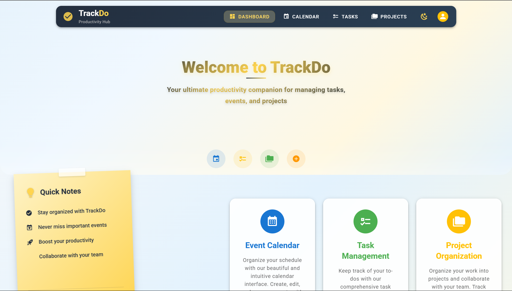
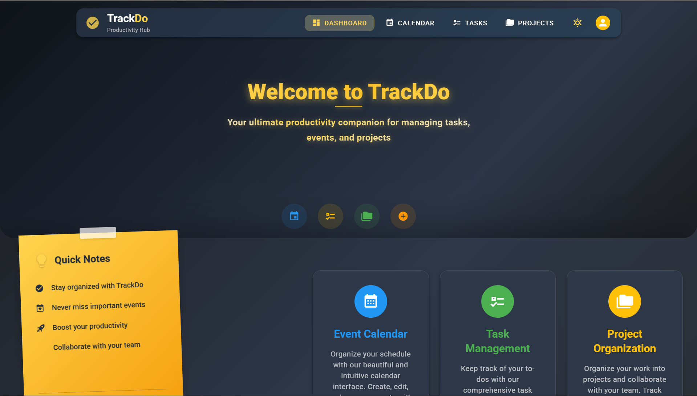

<div align="center">
  
  
  # 🚀 TrackDo - Modern Task Management Application
  
  <p align="center">
    <strong>A comprehensive full-stack task management solution built with Vue.js 3, Vuetify, and MongoDB</strong>
  </p>
  
  <p align="center">
    
    
    
    
  </p>
  
  <p align="center">
    
    
    
  </p>
</div>

---

## 📚 Table of Contents

- [📖 About TrackDo](#-about-trackdo)
- [✨ Key Features](#-key-features)
- [🖼️ Screenshots](#️-screenshots)
- [📁 Project Structure](#-project-structure)
- [🛠 System Requirements](#-system-requirements)
- [📦 Installation & Setup](#-installation--setup)
- [🚀 Running the Application](#-running-the-application)
- [🔌 API Endpoints](#-api-endpoints)
- [🛠 Technologies Used](#-technologies-used)
- [🔧 Development Commands](#-development-commands)
- [🚨 Troubleshooting](#-troubleshooting)
- [📈 Future Enhancements](#-future-enhancements)
- [🤝 Contributing](#-contributing)

---

## 📖 About TrackDo

TrackDo is a modern, full-stack task management application designed to help individuals and teams organize their projects, tasks, and events efficiently. Built with cutting-edge technologies, it offers a beautiful, responsive user interface that works seamlessly across all devices.

### 🎯 Mission
To provide a comprehensive, user-friendly platform that streamlines project management, task tracking, and event scheduling in one unified application.

### ✨ Key Highlights
- 🎯 **Complete Project Management** - From planning to completion
- ✅ **Advanced Task System** - Priority-based task organization with status tracking
- 📅 **Integrated Calendar** - Schedule and manage events with visual calendar interface
- 🎨 **Modern UI/UX** - Clean, intuitive interface with dark/light theme support
- 📱 **Fully Responsive** - Works perfectly on desktop, tablet, and mobile devices
- 🔄 **Real-time Updates** - Dynamic state management with Pinia
- 🚀 **Fast Performance** - Built with Vite for lightning-fast development and builds

---

## ✨ Key Features

### 📊 Dashboard & Analytics
- **Quick Stats Overview** - Real-time statistics for projects, tasks, and events
- **Progress Tracking** - Visual progress indicators and completion rates
- **Status Management** - Comprehensive status tracking across all entities
- **Activity Summary** - Recent activities and upcoming deadlines

### 📋 Project Management
- **Full CRUD Operations** - Create, read, update, and delete projects
- **Progress Tracking** - Visual progress bars with percentage completion
- **Status Management** - Active, completed, on-hold, and cancelled states
- **Priority Levels** - High, medium, and low priority classification
- **Advanced Filtering** - Filter by status, priority, and search functionality
- **Project Details** - Rich descriptions, deadlines, and metadata

### ✅ Task Management
- **Comprehensive Task System** - Complete task lifecycle management
- **Priority System** - High, medium, low priority tasks with color coding
- **Status Tracking** - Todo, in-progress, completed, and cancelled states
- **Due Date Management** - Date-based task scheduling with reminders
- **Tag System** - Categorize tasks with custom tags for better organization
- **Advanced Filtering** - Multi-criteria filtering and search capabilities
- **Task Dependencies** - Link related tasks and manage dependencies

### 📅 Event & Calendar Management
- **Interactive Calendar** - Beautiful calendar interface with multiple views
- **Event Scheduling** - Create and manage events with dates and times
- **Event Categories** - Different event types and classifications
- **Recurring Events** - Support for repeating events and patterns
- **Event Details** - Rich event descriptions, locations, and attendees
- **Calendar Integration** - Seamless integration with task deadlines

### 🎨 User Interface & Experience
- **Responsive Design** - Mobile-first design that adapts to all screen sizes
- **Modern Material Design** - Clean, professional interface using Vuetify components
- **Dark/Light Theme** - Automatic theme detection and manual switching
- **Custom Scrollbars** - Hidden scrollbars for cleaner appearance
- **Floating Action Buttons** - Quick access to create new items
- **Loading States** - Smooth loading indicators and skeleton screens
- **Error Handling** - User-friendly error messages and validation
- **Accessibility** - WCAG compliant design for better accessibility

---

## 🖼️ Screenshots

<div align="center">

### 📊 Dashboard Overview
<table>
  <tr>
    <td align="center">
      
      <br>
      <strong>📊 Dashboard - Light Mode</strong>
    </td>
    <td align="center">
      
      <br>
      <strong>🌙 Dashboard - Dark Mode</strong>
    </td>
  </tr>
</table>

### 🎯 Application Preview


https://github.com/user-attachments/assets/8c849249-1248-4ed4-8bd7-a615e89aa62e

</div>

---

## 📁 Project Structure

```
trackdo/
├── 📁 src/                          # Frontend source code
│   ├── 📁 components/              # Reusable Vue components
│   │   ├── 📁 calendar/           # Calendar-specific components
│   │   ├── 📁 projects/           # Project management components
│   │   ├── 📁 tasks/              # Task management components
│   │   ├── 📁 auth/               # Authentication components
│   │   └── 📁 common/             # Shared components
│   ├── 📁 pages/                  # Main application pages
│   │   ├── 📄 index.vue           # Dashboard page
│   │   ├── 📄 projects.vue        # Projects management
│   │   ├── 📄 tasks.vue           # Tasks management
│   │   ├── 📄 calendar.vue        # Calendar & events
│   │   └── 📄 auth.vue            # Authentication page
│   ├── 📁 stores/                 # Pinia state management
│   ├── 📁 services/               # API and external services
│   ├── 📁 router/                 # Vue Router configuration
│   ├── 📁 styles/                 # Global CSS and SCSS
│   ├── 📁 plugins/                # Vue plugins and configurations
│   └── 📁 utils/                  # Utility functions
├── 📁 backend/                     # Backend API server
│   ├── 📁 migrations/             # Database migration scripts
│   │   └── 📄 setup-database.js   # MongoDB setup script
│   ├── 📄 package.json            # Backend dependencies
│   └── 📄 server.js               # Main server file (includes models, routes, middleware)
├── 📁 public/                     # Static assets
├── 📄 package.json                # Frontend dependencies & scripts
├── 📄 vite.config.mjs             # Vite configuration
├── 📄 MONGODB_SETUP.md            # MongoDB setup documentation
└── 📄 README.md                   # This file
```

---

## 🛠 System Requirements

<div align="center">
  
  
</div>

### 📋 Prerequisites

| Requirement | Version | Download Link |
|-------------|---------|---------------|
|  | 16.0+ | [Download Node.js](https://nodejs.org/) |
|  | 4.4+ | [Download MongoDB](https://www.mongodb.com/try/download/community) |
|  | Latest | [Download Git](https://git-scm.com/) |

---

## 📦 Installation & Setup

### 🚀 Quick Start

#### Step 1: Clone the Repository
```bash
git clone https://github.com/LeHTVy/trackdo_vuetify3.git
cd trackdo
```

#### Step 2: Install Dependencies
```bash
# Install all dependencies (frontend + backend)
npm run install:all
```

<details>
<summary>📋 Alternative: Install Separately</summary>

```bash
# Frontend dependencies
npm install

# Backend dependencies
npm run backend:install
```
</details>

#### Step 3: Environment Setup

1. **Create environment file:**
   ```bash
   # Create .env file in the root directory
   touch .env
   ```

2. **Configure your `.env` file:**
   ```env
   # Frontend Configuration
   VITE_API_BASE_URL=http://localhost:3000/api

   # Backend Configuration  
   MONGODB_URI=mongodb://localhost:27017/trackdo
   MONGODB_DB_NAME=trackdo
   PORT=3000
   CORS_ORIGIN=http://localhost:5173

   # Environment
   NODE_ENV=development
   ```

#### Step 4: Start MongoDB
```bash
# Windows
net start MongoDB

# macOS (with Homebrew)
brew services start mongodb-community

# Linux
sudo systemctl start mongod
```

#### Step 5: Launch the Application
```bash
# Start both frontend and backend
npm run dev:full
```

### 🎉 Success!

Your application should now be running:
- **Frontend**: http://localhost:5173 (or http://localhost:5174)
- **Backend API**: http://localhost:3000/api
- **MongoDB**: mongodb://localhost:27017/trackdo

<div align="center">
  
</div>

---

## 🚀 Running the Application

### 🔥 Development Mode (Recommended)

```bash
# Run both frontend and backend concurrently
npm run dev:full
```

This command starts both servers:
- **Frontend**: `http://localhost:5173` (Vite dev server)
- **Backend**: `http://localhost:3000` (Express API server)

### 🌐 LAN Access (Network Development)

```bash
# Run with LAN access for testing on other devices
npm run dev:full:lan
```

### 🔧 Run Separately

```bash
# Frontend only
npm run dev

# Backend only
npm run backend:dev

# Frontend with LAN access
npm run dev:lan

# Backend with LAN access
npm run backend:dev:lan
```

### 🏗️ Production Build

```bash
# Build for production
npm run build

# Preview production build
npm run preview
```

---

## 🔌 API Endpoints

Backend API runs on `http://localhost:3000/api`

### 🏥 Health Check
- `GET /api/health` - Check API status and database connectivity

### 📋 Projects API
- `GET /api/projects` - Get all projects
- `POST /api/projects` - Create new project
- `PUT /api/projects/:id` - Update existing project
- `DELETE /api/projects/:id` - Delete project

### ✅ Tasks API
- `GET /api/tasks` - Get all tasks
- `POST /api/tasks` - Create new task
- `PUT /api/tasks/:id` - Update existing task
- `DELETE /api/tasks/:id` - Delete task

### 📅 Events API
- `GET /api/events` - Get all events
- `POST /api/events` - Create new event
- `PUT /api/events/:id` - Update existing event
- `DELETE /api/events/:id` - Delete event

---

## 🛠 Technologies Used

### 🎨 Frontend Stack
- **Vue.js 3** - Progressive JavaScript framework with Composition API
- **Vuetify 3** - Material Design component framework
- **Pinia** - Intuitive state management library
- **Vue Router** - Official router for Vue.js
- **Axios** - Promise-based HTTP client
- **Vite** - Next generation frontend tooling
- **SCSS/CSS** - Styling with preprocessor support
- **Schedule-X** - Modern calendar component

### ⚙️ Backend Stack
- **Node.js** - JavaScript runtime environment
- **Express.js** - Fast, unopinionated web framework
- **MongoDB** - NoSQL document database
- **Mongoose** - Elegant MongoDB object modeling
- **CORS** - Cross-origin resource sharing middleware
- **Helmet** - Security middleware for Express
- **Morgan** - HTTP request logger middleware
- **dotenv** - Environment variable management

### 🔧 Development Tools
- **ESLint** - Code linting and formatting
- **Concurrently** - Run multiple commands simultaneously
- **Nodemon** - Auto-restart development server
- **Unplugin** - Auto-import and component registration
- **Vite Plugins** - Enhanced development experience

---

## 🔧 Development Commands

### 🧹 Code Quality

```bash
# Run ESLint to check and fix code issues
npm run lint
```

### 🏗️ Building

```bash
# Build the frontend application for production
npm run build

# Preview the production build
npm run preview
```

### 🔄 Backend Development

```bash
# Start backend in development mode with auto-restart
npm run backend:dev

# Start backend with LAN access
npm run backend:dev:lan
```

### 📦 Dependency Management

```bash
# Install all dependencies (frontend + backend)
npm run install:all

# Install frontend dependencies only
npm install

# Install backend dependencies only
npm run backend:install
```

---

## 🚨 Troubleshooting

### 🔌 MongoDB Connection Issues
- ✅ Ensure MongoDB service is running
- ✅ Check connection string in `.env` file
- ✅ Verify firewall settings for port 27017
- ✅ Check MongoDB logs for connection errors

### 🌐 API 404 Errors
- ✅ Ensure backend server is running on port 3000
- ✅ Check CORS configuration in backend
- ✅ Verify API endpoints in browser DevTools
- ✅ Check network requests and responses

### 🔌 Port Conflicts
- **Frontend**: Default port 5173, fallback to 5174
- **Backend**: Default port 3000
- **MongoDB**: Default port 27017
- Modify port configurations in respective config files if needed

### 🏗️ Build Issues
- ✅ Clear `node_modules` and reinstall dependencies
- ✅ Check Node.js version compatibility (v16+)
- ✅ Verify all environment variables are set
- ✅ Check for syntax errors in code

### 🔧 Common Solutions

```bash
# Clear cache and reinstall
rm -rf node_modules package-lock.json
npm install
npm run install:all

# Reset development environment
npm run dev:full
```

---

## 📈 Future Enhancements

### 🚀 Planned Features
- **Enhanced Authentication** - Upgrade to JWT-based authentication (currently using basic tokens)
- **Real-time Notifications** - WebSocket-based live updates
- **File Attachments** - Upload and manage files for projects/tasks
- **Team Collaboration** - Multi-user support with role-based permissions
- **Advanced Analytics** - Detailed reporting and analytics dashboard
- **Mobile App** - Native mobile application
- **Email Integration** - Email notifications and reminders
- **API Documentation** - Interactive API documentation with Swagger

### 🔧 Technical Improvements
- **Testing Suite** - Unit and integration test coverage
- **CI/CD Pipeline** - Automated deployment and testing
- **Docker Support** - Containerization for easier deployment
- **Performance Optimization** - Code splitting and lazy loading
- **PWA Features** - Progressive Web App capabilities
- **Internationalization** - Multi-language support

---

## 🤝 Contributing

We welcome contributions to TrackDo! Here's how you can help:

### 🌟 Ways to Contribute

- 🐛 **Report Bugs** - Found a bug? Open an issue
- 💡 **Suggest Features** - Have an idea? Create a feature request
- 🔧 **Submit Pull Requests** - Ready to code? Fork and submit a PR
- 📖 **Improve Documentation** - Help make our docs better
- 🎨 **Design Improvements** - Enhance the UI/UX

### 📋 Development Workflow

1. **Fork the repository**
2. **Create a feature branch**: `git checkout -b feature/amazing-feature`
3. **Make your changes**
4. **Run tests**: `npm run lint`
5. **Commit your changes**: `git commit -m 'Add amazing feature'`
6. **Push to branch**: `git push origin feature/amazing-feature`
7. **Open a Pull Request**

### 📝 Code Style Guidelines

- Follow the existing code style and conventions
- Use meaningful commit messages
- Add comments for complex logic
- Update documentation when needed
- Ensure all tests pass before submitting

<div align="center">
  
</div>

---

<div align="center">
  
### 🌟 Star this repository if you found it helpful!


**TrackDo** - *Streamline your workflow, track your progress, achieve your goals!* 🚀

<p>
  <a href="#-table-of-contents">⬆️ Back to Top</a>
</p>

---

<div align="center">
  
  
</div>

<sub>Built with passion and dedication by **VyLe** 🚀</sub>

</div>
